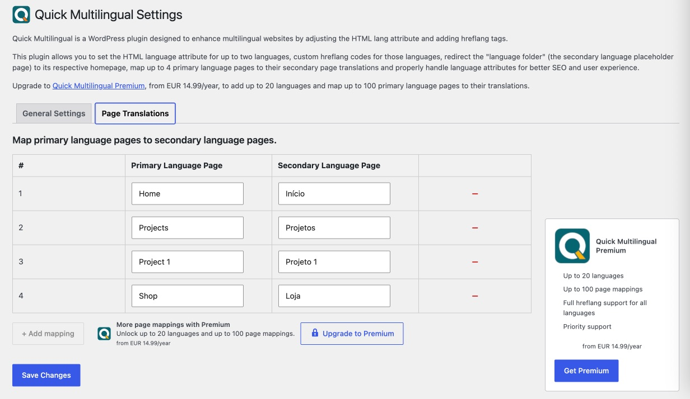
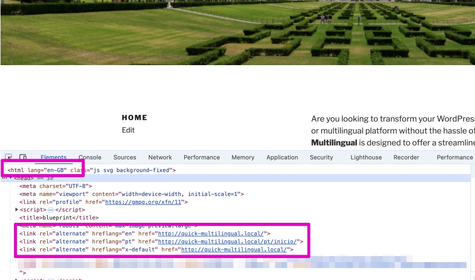
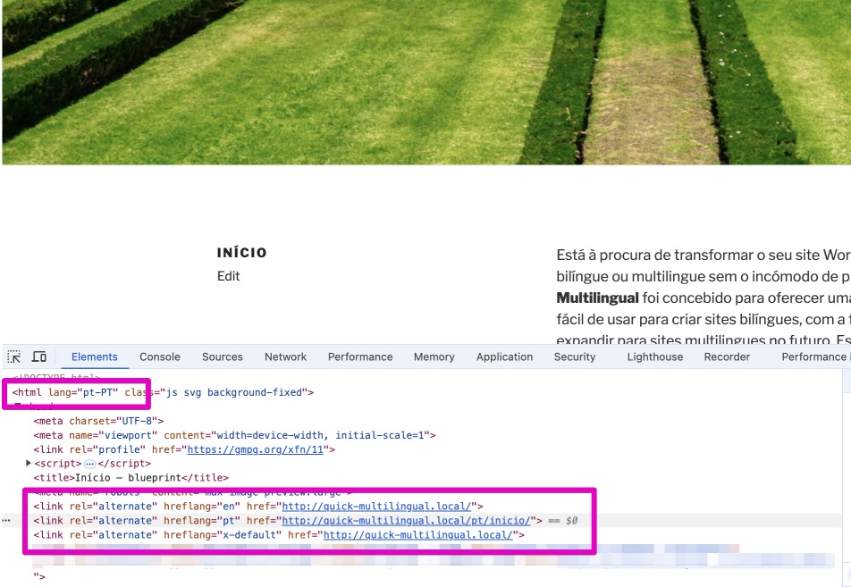

# Quick Multilingual

  

###### Last updated on September 5, 2026
###### Development version 2.0.2
###### requires at least WordPress 6.2
###### tested up to WordPress 7.1
###### Author: [Pieter Bos](https://github.com/senlin)

Quick Multilingual allows you to create multilingual brochure sites on WordPress with automatic language attributes and hreflang tags.

## Description

Quick Multilingual is a WordPress plugin designed to offer a streamlined, user-friendly solution for creating bilingual websites with the flexibility to expand into multilingual sites in the future. This Lite version is tailored for smaller websites with up to two languages and a maximum of four pages, making it perfect for businesses and individuals who need a straightforward setup. The plugin automatically adjusts the HTML lang attribute and adding hreflang tags for better SEO and user experience.

## Features

* **Adjust HTML Lang Attribute:** Dynamically set the `lang` attribute in the HTML tag based on the current language.
* **Custom Hreflang Tags:** Define custom `hreflang` tags for primary and secondary languages.
* **Canonical link:** automatically set.
* **Language Folder Redirection:** Redirect the parent language folder to the secondary language homepage.
* **Mapping:** map up to 4 pages of the primary language to their translation in the secondary language.
* **Easy Configuration:** User-friendly settings page for managing language settings and redirections.
* **Settings Link:** Convenient link to the plugin settings from the main Plugins page.

## Installation

1. Upload the `quick-multilingual` folder to the `/wp-content/plugins/` directory.
2. Activate the plugin through the 'Plugins' menu in WordPress.
3. Read "Configuration" in readme file.
4. Go to **Settings > Quick Multilingual** to configure the plugin.

## Configuration

1. **Add Pages:** Create your website pages in the primary language as usual. For the secondary language, create a language “folder” page and add child pages underneath for each translated page.
2. **General Settings:** Navigate to the Settings page and configure the HTML language attributes (there is a link included to look those up) for your primary and secondary languages. Define the language “folder” page and specify the number of pages your website will have (up to four in the Lite version).
3. **Map Translations:** Use the Translation Mapping tab to link each secondary language page to its corresponding primary language page. Important: make sure to set the homepage as first mapped page.
4. **Finalise with Navigation:** Add the main navigation menu with the primary language pages and the secondary language “folder” under which you can add the translated (child) pages. The plugin handles all the necessary technical details, ensuring your multilingual site functions smoothly with the correct language tags and redirections.

## Frequently Asked Questions

### How do I determine the correct HTML lang attribute and hreflang code for my languages?

You can find the appropriate HTML lang attributes and hreflang codes for most languages [here](https://gist.github.com/JamieMason/3748498).

### What if my secondary language homepage is not listed?

Ensure the page is published and not in draft mode. Refresh the settings page to update the list of pages.

### Can I use this plugin with any WordPress theme?

Yes, this plugin is designed to work with most themes, but menu handling is not included. You may need to customise your theme if it has specific requirements for multilingual navigation.

### With a settings page comes additional entries in the database; what happens on uninstall?

Great question!
Indeed the Quick Multilingual plugin writes its settings to the database. The included `uninstall.php` file removes all the plugin-related entries from the database once you remove the plugin via the WordPress Plugins page (not on deactivation).

### I have an issue with this plugin, where can I get support?

Please open an issue on [Github](https://github.com/senlin/quick-multilingual/issues)

## Contributions

I welcome your contributions very much! PR's will be considered and of course bug reports and feature requests can also be seen as contributions!
**If you're interested in becoming involved, please [let me know](https://so-wp.com/contact) or simply send a PR with your proposed improvement.**

## License

* License: GNU Version 2 or Any Later Version
* License URI: http://www.gnu.org/licenses/gpl-2.0.html

## Donations

* Donate link: https://so-wp.com/donations

## Connect with me through

[BHI Localization for Websites](https://www.bhi-localization.com)

[SO WP Plugins](https://so-wp.com/)

[Github](https://github.com/senlin)

[LinkedIn](https://www.linkedin.com/in/pieterbos83)

[WordPress](https://profiles.wordpress.org/senlin/)

## Screenshots

Plugin Settings page (two tabs) and frontend output.

---

---

---

## Changelog

### 2.0.2

* date: September 5, 2026
* Fixed: silenced Plugin Check prefix warnings on the uninstall.php helper variables and the so_qmp filter names (false positives; the sniffer derives its expected prefix from the plugin name).

### 2.0.1

* date: September 5, 2026
* Added: filter-aware accessors for tier limits (so_qmp/tier, so_qmp/max_languages, so_qmp/max_page_mappings) in preparation for the Premium addon.
* Changed: the html lang attribute is now driven by the plugin's page mappings instead of page hierarchy; pages removed from the mapping fall back to the primary language.
* Fixed: unmapped pages no longer output self-referencing hreflang and x-default links.
* Fixed: mapping rows beyond the stored "Number of Pages to Map" are ignored on the frontend and deleted from the database when the count is reduced.

### 2.0.0

* date: August 19, 2026
* Note: Major refactor. Minimum WP raised to 6.2. Minimum PHP raised to 8.2. No breaking changes to stored settings; existing `so_qmp_*` options are preserved.
* New: OOP architecture under the `SOWP\QuickMultilingual` namespace with split class files in `src/`.
* New: Canonical URL output for mapped pages (`<link rel="canonical">`), removing WordPress core `rel_canonical` on those pages to prevent duplicate tags.
* New: Activation guard deactivates the plugin and shows an admin notice when PHP < 8.2 or WordPress < 6.2.
* Changed: Minimum PHP requirement raised from 7.0 to 8.2.
* Changed: Minimum WP requirement raised from 5.0 to 6.2
* Changed: Page mapping loop now follows the tier limit (`MAX_PAGE_MAPPINGS = 4`) instead of a hardcoded 4, preparing for the Premium tier.
* Developer: Lite/Premium roadmap; tier limits centralised in `Config`. Settings page markup kept compatible with the existing `admin.js` (`.nav-tab`, `.so_qmp-tab-content`, `#so_qmp_number_of_pages`, `#page-translations-table`, `.page-mapping-row`).

### 1.5.8

* date: August 19, 2026
* Fixed: HTML lang attribute now correctly switches to the secondary language based on the page hierarchy instead of unreliable URL string matching.

### 1.5.7

* date: August 18, 2026
* Fixed: Escaped all admin option outputs and dropdowns to satisfy PHPCS/PCP checks and prevent unescaped output vulnerabilities.
* Fixed: Added explicit casting with absint() for stored page IDs (for example so_qmp_language_folder_page) to ensure integer values are used where expected.
* Fixed: Added translators comment for the "Page %d" label to clarify the placeholder meaning.
* Changed: Replaced hardcoded script version with SO_QMP_VERSION and bumped asset versioning to improve cache-busting for admin.js and admin.css.
* Fixed: Added a targeted PHPCS ignore for an admin-only exclude usage in wp_dropdown_pages() to address a WordPress VIP performance warning (settings screen; excludes a small, bounded set of pages).
* Changed: Prefixed uninstall.php file-scope variables to follow plugin naming conventions and remove PCP naming warnings.
* Notes: No breaking changes. Behaviour is unchanged; changes are defensive and to satisfy code-quality checks.
* tested up to WP 7.1

### 1.5.6

* date: April 27, 2025
* removed redundant `load_plugin_textdomain()` function and increased min required WP version
* tested up to WP 6.8

### 1.5.5

* September 26, 2024
* Make HTML lang attribute output more robust

### 1.5.4

* September 26, 2024
* Plugin approved by WP Plugins Review Team
* Update readme files with screenshots

### 1.5.3

* Change the namespace from `hlh`_ to `so_qmp_`
* Improve sanitisation and escaping throughout the plugin
* Properly enqueue scripts and styles
* Internationalise all user-facing strings, including those in JavaScript
* Update the uninstall.php file for better security and precision
* Ensure proper handling of external links

### 1.5.2

* Resolve three errors (checking existence, unslashing, and sanitizing) that came up after running code through Plugin Check (PCP) plugin, which is requirement for release on WP Plugins Directory

### 1.5.1

* Fix typos

### 1.5.0

* Add `uninstall.php` file to remove all registered settings from `wp_options` table upon plugin deletion.

### 1.4.0

* Adjusted custom hreflang code options for both primary and secondary languages.
* Add option to set the secondary language "folder", the page that functions as the placeholder for the translations.
* Add option to have user select the number of pages that need mapping (up to 4).
* Adjust Page Translations UI to exclude the the secondary language folder from both primary and secondary language drop downs.

### 1.3.0

* Added custom hreflang code options for both primary and secondary languages.
* Fixed HTML lang attribute output based on the selected language.
* Included a settings link on the main Plugins page.
* Removed navigation menu handling as it is managed through custom theme code.

### 1.2.0

* Improved hreflang tag generation to reflect proper language codes.
* Added redirection from parent language page to secondary language homepage.

### 1.1.0

* Initial release with basic functionality for setting HTML lang attribute and hreflang tags.

